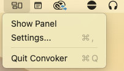

<p align="center">
  
</p>

<h1 align="center">Convoker</h1>

<p align="center">
  <strong>Type an app name, press Enter, all its windows come to you.</strong>
</p>

<p align="center">
  Per-app window control, app launcher, and workspace management for macOS.
</p>

<p align="center">
  <a href="https://github.com/varie-ai/convoker/releases/latest">Download</a> &bull;
  <a href="#features">Features</a> &bull;
  <a href="#keyboard-shortcuts">Shortcuts</a> &bull;
  <a href="#install">Install</a>
</p>

---

<p align="center">
  
</p>

## Quick Start

1. Launch Convoker — it lives in your **menu bar**
2. Press **Cmd+Shift+X** to open the command palette
3. Type an app name → **Enter** to gather its windows

<p align="center">
  
</p>

> Right-click the menu bar icon for Settings (change hotkey) or to quit.

## The Problem

You have 6 Safari windows scattered across 3 monitors. Or Terminal sessions everywhere. You want them *here*, on *this* screen, right now.

Existing tools snap **individual windows**. Convoker operates on **all windows of an app at once**. No other tool does this.

## Features

**Gather** — Bring all windows of an app to your current screen, arranged in a smart grid.

**Focus** — Activate an app and hide everything else. Zero clutter, zero rearranging.

**Split** — Pin one app, pick another, get instant side-by-side (or 3-way, or 4-way).

**Workspaces** — Save your app arrangement as a named workspace. Type the name, press Enter — apps launch, windows arrange, distractions hide. Works across multiple monitors.

**Launch** — App not running? Convoker launches it and arranges its windows automatically.

**Layout options** — Grid (default), cascade, side-by-side, or columns.

## Keyboard Shortcuts

Press **Cmd+Shift+X** to open the palette, then:

| Shortcut | Action |
|----------|--------|
| **Enter** | Gather all windows to current screen |
| **Shift+Enter** | Gather + maximize |
| **Cmd+Enter** | Focus (activate + hide all others) |
| **Tab** | Pin app for split (up to 4 apps) |
| **Tab, then Enter** | Split pinned apps side-by-side |
| **Cmd+Shift+S** | Save pinned apps as a workspace |
| Type **"save"** | Save current screen as a workspace |
| **Escape** | Dismiss (or unpin last) |
| **Arrow keys** | Navigate the app list |

The hotkey is configurable in Settings (tray icon > Settings).

## Install

### Download (recommended)

1. Download the latest `.dmg` from [Releases](https://github.com/varie-ai/convoker/releases/latest)
2. Drag **Convoker.app** to `/Applications`
3. Launch Convoker — grant Accessibility permission when prompted
4. Look for the Convoker icon in your **menu bar**, then press **Cmd+Shift+X**

### Build from source

```bash
git clone https://github.com/varie-ai/convoker.git
cd convoker/Convoker
./build.sh run
```

Requires Xcode 15+ and macOS 14+.

## Requirements

- **macOS 14 (Sonoma)** or later
- **Accessibility permission** — required to discover and move windows

## How It Works

Convoker uses the macOS Accessibility API (AXUIElement) to enumerate and reposition windows. It's a menu bar app with a floating command palette (like Spotlight). No background processes, no daemons, no config files.

The search uses [fuse-swift](https://github.com/krisk/fuse-swift) for fuzzy matching and [KeyboardShortcuts](https://github.com/sindresorhus/KeyboardShortcuts) for the global hotkey.

## FAQ

**Why not use Rectangle / Magnet / BetterSnapTool?**
Those are great for snapping *individual* windows. Convoker targets *all windows of a specific app* — a different workflow entirely. They complement each other.

**Why not use yabai / AeroSpace?**
Tiling window managers are always-on and manage every window. Convoker is on-demand — it only acts when you ask, and never rearranges anything automatically.

**Does it work with Stage Manager?**
Yes. Convoker doesn't interfere with Stage Manager, but it works best with Stage Manager disabled.

**Will it work on Apple Silicon and Intel?**
Yes. It's a universal binary.

## License

[MIT](LICENSE)

## Credits

Built by [Varie.AI](https://varie.ai) with [Claude Code](https://claude.ai/claude-code).
